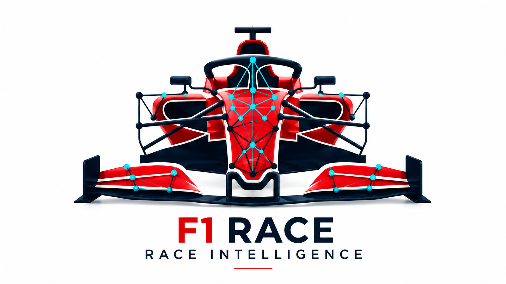
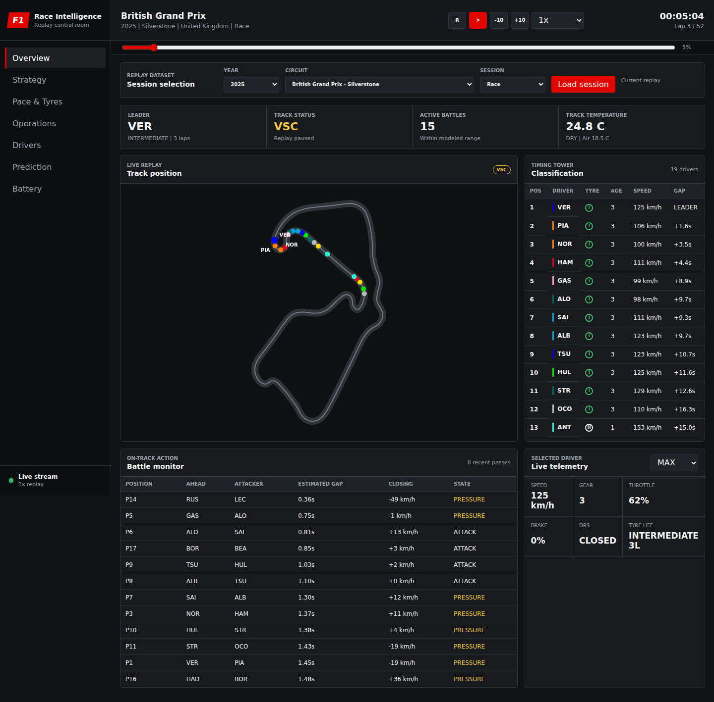
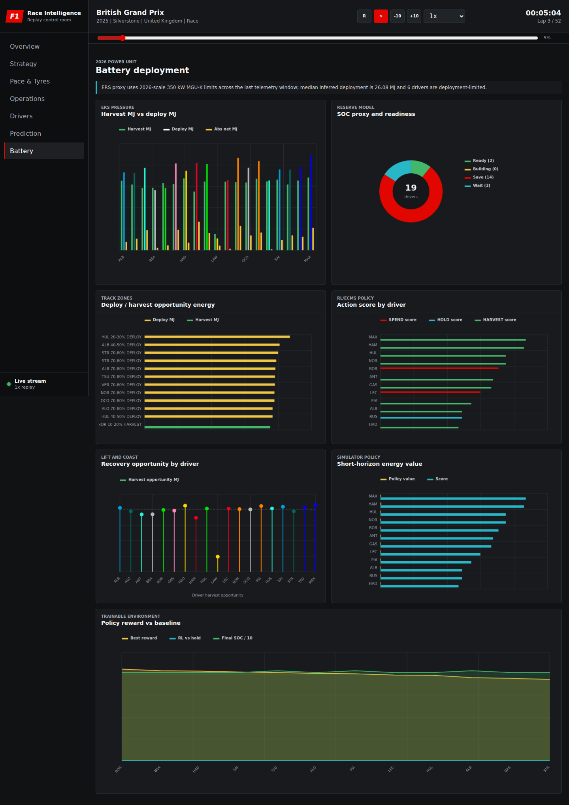

# F1 Race Intelligence

<p align="center">
  
</p>

F1 Race Intelligence is a server-first Formula 1 replay and decision-support
dashboard. It turns publicly available timing, telemetry, weather, track-status,
and race-control data into a synchronized track replay, live classification,
driver comparisons, strategy exploration, finish predictions, and experimental
2026-style battery analysis.

The application is designed to run locally, in Docker, or on a remote Linux
server such as an AWS EC2 instance. The browser is only a lightweight client:
session preparation, replay state, and analysis are owned by the FastAPI server
and streamed to connected dashboards over WebSocket.

## Project Story

I have been building this project over several months. The replay-dashboard idea
was inspired by [IAmTomShaw/f1-race-replay](https://github.com/IAmTomShaw/f1-race-replay),
which showed how compelling public Formula 1 telemetry can become when it is
presented as a race replay.

I am an AI Engineer, so I expanded that foundation into a modular, server-based
race-intelligence system. Beyond the dashboard itself, I modelled predictive and
decision-support methods around the data that is actually available: Monte Carlo
finish simulation, telemetry-derived tyre and battle models, constrained
strategy generation, and an experimental hybrid-energy environment for the
Battery tab.

AI-assisted coding was used to improve implementation efficiency. Each assisted
change remained under direct supervision within its owning module, was manually
reviewed, and was validated with manually authored test cases appropriate to its
behavior. The project structure, feature direction, model choices, integration,
and validation remain deliberate engineering work.



## What It Does

- Replays historical Formula 1 sessions on an animated circuit map.
- Loads Race, Sprint, Qualifying, Sprint Qualifying, FP1, FP2, and FP3 sessions.
- Switches year, circuit, and session from the Overview page.
- Displays classification, tyres, speed, gaps, weather, track status, and driver
  telemetry against replay time.
- Detects battle windows, position swaps, pit events, and race-control priority.
- Compares driver pace, position evolution, speed, tyre age, overtakes, and stops.
- Estimates tyre degradation and stint health from clean laps.
- Generates diverse race-strategy trajectories with live risk controls.
- Simulates 400 possible race completions for finish, win, podium, and points
  probabilities.
- Infers relative ERS deployment, harvesting, reserve pressure, recovery zones,
  and action value from public telemetry.
- Exposes an RL-compatible battery environment and compares an interpretable
  energy policy with fixed-action baselines.
- Streams shared replay state to multiple browser clients from one server.

## Model Status

| Area | Method | What the output means |
| --- | --- | --- |
| Finish prediction | Seeded Monte Carlo simulation | A replay-conditioned probability estimate, not an official forecast |
| Tyre model | Clean-lap median and linear degradation slope | Observed stint trend from available lap data |
| Strategy | Reward-shaped constrained trajectory sampling | Diverse scenario recommendations from an interpretable simulator |
| Battery power | Rules over speed delta, throttle, brake, and DRS | Inferred deployment/harvest proxy, not measured electrical power |
| Battery SOC | Bounded net-energy proxy | Relative reserve awareness, not ECU state-of-charge |
| Energy policy | ECMS-inspired local scoring and heuristic rollout | Decision-support research output, not a trained production RL controller |

The distinction matters: public timing feeds do not expose true battery
state-of-charge, electrical current, cell temperature, motor torque, private
engine maps, or team strategy targets. See
[Model Boundaries](wiki/Model-Boundaries.md) before interpreting AI output.

## Quick Start

Python 3.10 or newer is recommended. Python 3.12 matches the container image.

```bash
cd /home/visha/projects/F1
python3 -m venv .venv-server
source .venv-server/bin/activate
python -m pip install --upgrade pip
python -m pip install -r requirements.txt
python main.py --server
```

Open [http://127.0.0.1:8000](http://127.0.0.1:8000).

The default session is the 2025 season, round 12, Race. Select another dataset
from the Overview tab, or configure startup explicitly:

```bash
F1_YEAR=2024 \
F1_ROUND=7 \
F1_SESSION=R \
F1_HOST=0.0.0.0 \
F1_PORT=8000 \
python main.py --server
```

Equivalent command-line options are available:

```bash
python main.py --server \
  --year 2024 \
  --round 7 \
  --session R \
  --host 0.0.0.0 \
  --port 8000
```

Use `--paused` to load without autoplay and `--refresh-data` to rebuild computed
telemetry. The first uncached load can take several minutes; the dashboard shows
the preparation stage and percentage throughout the load.

## Docker

```bash
docker compose up --build
```

The dashboard is served on [http://127.0.0.1:8000](http://127.0.0.1:8000).
Docker Compose persists both the FastF1 request cache and computed replay data in
named volumes.

## Configuration

| Variable | Default | Purpose |
| --- | --- | --- |
| `F1_YEAR` | `2025` | Startup championship year |
| `F1_ROUND` | `12` | Startup round number |
| `F1_SESSION` | `R` | Startup session code |
| `F1_HOST` | `127.0.0.1` | Bind address |
| `F1_PORT` | `8000` | HTTP port |

Session codes are `R`, `S`, `Q`, `SQ`, `FP1`, `FP2`, and `FP3`.

## Architecture

```text
FastF1 session
    -> telemetry preparation and caching
    -> ReplayDataset
    -> HeadlessReplayController
    -> RaceIntelligenceEngine
    -> REST bootstrap/control + WebSocket dashboard stream
    -> lightweight HTML/CSS/Canvas client
```

The main ownership boundaries are:

```text
src/data/          FastF1 loading, telemetry alignment, cache, Safety Car data
src/intelligence/  Race, strategy-flow, battery, and replay-event models
src/server/        FastAPI app, replay controller, dataset adapters, API models
src/server/static/ Browser dashboard and canvas chart/replay components
src/lib/           Small shared domain utilities and settings
tests/             Unit and server integration tests
wiki/              Detailed project documentation
```

Read the [Architecture wiki](wiki/Architecture.md) for the complete runtime
flow and module responsibilities.

## Development

```bash
source .venv-server/bin/activate
python -m pip install -r requirements-dev.txt
pytest
node --check src/server/static/js/*.js
```

The API schema is available from a running server at
[http://127.0.0.1:8000/api/docs](http://127.0.0.1:8000/api/docs).

## Wiki

Start at [Wiki Home](wiki/Home.md). It covers:

- [Getting Started](wiki/Getting-Started.md)
- [Dashboard Guide](wiki/Dashboard-Guide.md)
- [Data and Replay Pipeline](wiki/Data-and-Replay-Pipeline.md)
- [Race Intelligence](wiki/Race-Intelligence.md)
- [Strategy Flow](wiki/Strategy-Flow.md)
- [Battery Intelligence and Algorithms](wiki/Battery-Intelligence.md)
- [Architecture](wiki/Architecture.md)
- [API Reference](wiki/API-Reference.md)
- [Deployment](wiki/Deployment.md)
- [Model Boundaries and Validation](wiki/Model-Boundaries.md)
- [Testing and Development](wiki/Testing-and-Development.md)
- [Research and Credits](wiki/Research-and-Credits.md)



## Credits

This project gives explicit credit to:

- [IAmTomShaw/f1-race-replay](https://github.com/IAmTomShaw/f1-race-replay)
  for the original replay-dashboard inspiration.
- [theOehrly/Fast-F1](https://github.com/theOehrly/Fast-F1) for the Python
  timing, telemetry, schedule, weather, and session-data interface on which this
  dashboard depends.
- The research authors and standards bodies listed in
  [Research and Credits](wiki/Research-and-Credits.md).

Formula 1, F1, FIA Formula One World Championship, Grand Prix, and related marks
belong to their respective owners. This is an independent, unofficial research
and visualization project and is not associated with Formula 1, the FIA, any
team, or any power-unit manufacturer.
