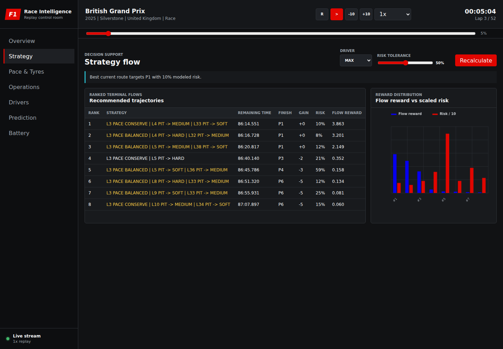

# Strategy Flow

The Strategy tab generates several useful race plans instead of returning one
apparently certain answer. `StrategyFlowEngine` builds feasible pit and pace
sequences, evaluates their modeled race outcomes, and keeps a varied set of
high-value alternatives.



## Model Approach

The strategy engine:

- Samples constrained strategy trajectories from hand-designed,
  reward-shaped priors.
- Evaluates each terminal trajectory with a deterministic race model.
- Ranks trajectories by positive reward.
- Filters repeated action profiles to preserve diversity.

It is an interpretable stochastic search and simulation method. It does not
train a neural policy, and its output is not a guaranteed global optimum.

## Strategy State

Each generation call builds a `StrategyContext` from the replay:

| State | Source |
| --- | --- |
| Current and total lap | Replay/session |
| Current compound and tyre age | Selected driver |
| Position | Selected driver |
| Baseline lap time | Driver clean-lap median, field median, or 90 s fallback |
| Pit loss | Median completed pit duration, clamped to 12-35 s, or 22 s |
| Safety Car | Current track-status code |
| Rain probability | 0.80 while source state says raining, otherwise 0.05 |
| Traffic risk | Cars within 250 m divided by four, capped at one |
| Risk tolerance | Dashboard slider from zero to one |

## Action Space

Two action families are supported:

```text
PIT(lap, compound)
PACE(current_lap, PUSH | BALANCED | CONSERVE)
```

Dry compounds are Soft, Medium, and Hard. Intermediate and Wet enter the
candidate set as rain probability rises.

The sampler chooses at most:

- One stop with fewer than 15 laps remaining.
- Two stops with at least 15 laps remaining.
- Three stops occasionally when at least 35 laps remain and risk tolerance
  supports more exploration.

Pit laps must be in the remaining race, selected pit stops are separated by at
least five laps where possible, and consecutive stints cannot use the same
compound.

## Stable Anchor Strategies

Before stochastic sampling, the engine creates deterministic anchors:

- Balanced pace with no new stop.
- One-stop plans around one-quarter, one-half, and two-thirds of remaining
  distance.
- Medium-to-Soft and Hard-to-Soft two-stop plans when enough distance remains.

Anchors keep recommendations understandable and stable even when random
exploration produces sparse candidates.

## Reward-Shaped Sampling

For each stop, central stint lengths receive more sampling weight than extreme
ones:

```text
weight(lap) = exp(-abs(lap - target_lap) / scale)
```

Compound flow estimates the cumulative base pace and degradation over the
future stint:

```text
predicted_loss =
    base_pace(compound) * stint_length
    + degradation(compound) * stint_length * (stint_length + 1) / 2
```

The non-normalized compound weight is:

```text
max(0.01, exp(-predicted_loss / 18))
```

Rain adjusts this weight: wet-weather compounds receive a benefit in likely wet
conditions and a large penalty in dry conditions.

Current compound parameters are:

| Compound | Base pace delta | Degradation per age-lap |
| --- | ---: | ---: |
| Soft | -0.55 s | 0.075 s |
| Medium | 0.00 s | 0.043 s |
| Hard | +0.45 s | 0.025 s |
| Intermediate | +5.00 s | 0.060 s |
| Wet | +10.00 s | 0.045 s |

These are transparent model coefficients, not confidential team tyre models.

## Terminal Evaluation

The evaluator simulates every remaining lap. A lap includes:

- Baseline pace.
- Compound base delta.
- Pace-mode delta.
- Age-dependent degradation.
- Nonlinear cliff loss beyond compound cliff age.
- Weather mismatch penalty.
- Pit loss and traffic exposure when a stop occurs.

Pace modes affect both immediate pace and degradation:

| Mode | Pace delta | Degradation multiplier |
| --- | ---: | ---: |
| Push | -0.20 s/lap | 1.28 |
| Balanced | 0.00 s/lap | 1.00 |
| Conserve | +0.28 s/lap | 0.78 |

An active Safety Car multiplies pit loss by `0.43`. Pit traffic adds a
deterministic penalty based on traffic risk and pit lap.

Risk begins at `0.08` and rises with:

- Laps beyond a compound cliff.
- Dry tyres in likely rain.
- Wet tyres in likely dry conditions.
- More than two stops.

The result is capped at one.

## Position and Reward

The model compares simulated time with a reference:

```text
reference =
    remaining_laps * (baseline_lap_seconds + 0.9)
    + normal_pit_loss

time_gain = reference - simulated_time
```

Every 4.5 modeled seconds maps to approximately one position, clamped to a gain
or loss of five places.

Positive terminal reward:

```text
reward = exp(clamp(time_gain, -30, 30) / 11)
reward *= max(
    0.08,
    1 - risk * (0.35 + 0.45 * (1 - risk_tolerance))
)
```

Higher dashboard risk tolerance reduces the penalty applied to risky plans.

## Diversity Selection

The engine samples at least 600 trajectories for the standard request, removes
exact duplicates, ranks by reward, and avoids repeating the same action profile
early in the returned list. The tab displays eight trajectories.

This produces alternatives such as different stop counts, compound sequences,
and pace modes even when their expected outcomes are close.

## Reading the UI

| Column | Interpretation |
| --- | --- |
| Rank | Reward order |
| Strategy | Ordered pace and pit instructions |
| Remaining time | Simulated time from now to finish |
| Finish | Modeled terminal position |
| Gain | Current position minus modeled finish |
| Risk | Heuristic tyre/weather/complexity exposure |
| Flow reward | Positive utility used for ranking |

Reward is meaningful for comparison within the same replay context. It is not a
probability and should not be compared directly across unrelated sessions.
